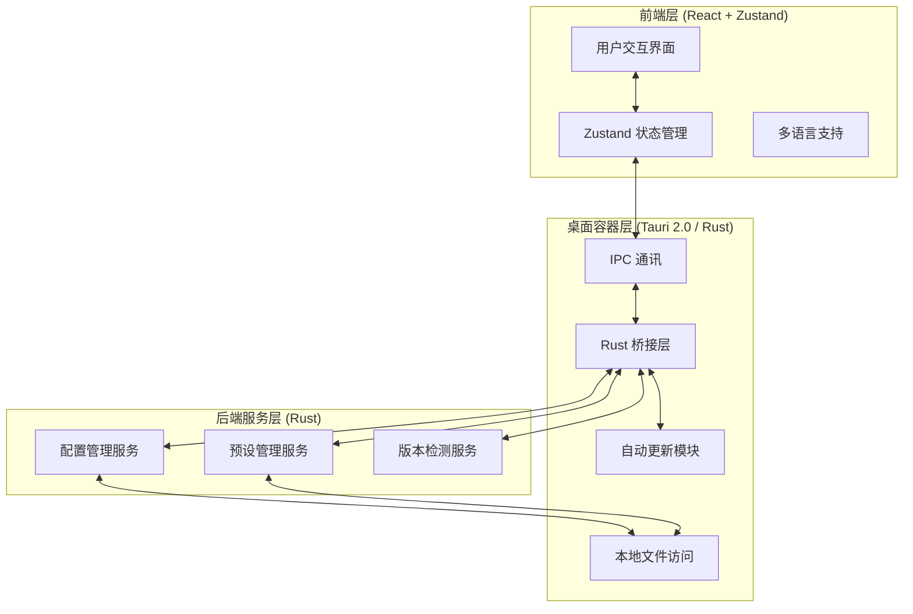

# 🔄 OMO Switch

[](https://github.com/ShellMonster/OMO-Switch/stargazers)
[](https://github.com/ShellMonster/OMO-Switch/blob/main/LICENSE)
[](https://github.com/ShellMonster/OMO-Switch/releases)


[English](README_EN.md) | [简体中文](README.md) | [繁體中文](README_TW.md) | [日本語](README_JP.md) | [한국어](README_KR.md)

**OMO Switch** 是一款专为 [oh-my-opencode](https://github.com/oh-my-opencode/oh-my-opencode) 打造的桌面端模型配置管理工具。基于 **Tauri 2.0** 构建，支持可视化切换 AI 模型、管理预设配置、浏览模型库，并提供自动更新功能。

<p align="center">
  
</p>

> 💡 **核心功能**：
> - **🤖 Agent 模型切换**：可视化管理所有 Agent 的模型配置
> - **📊 配置总览**：实时查看配置状态、已连接提供商、模型分配
> - **🔑 Provider 管理**：配置和管理 API Key 及模型提供商
> - **💾 预设管理**：保存和加载不同的模型配置预设
> - **🌐 模型库浏览**：查看可用模型、定价和能力信息
> - **📥 导入导出**：备份和恢复配置文件
> - **🔄 自动更新**：一键检查更新，自动下载安装
> - **🌍 多语言支持**：支持中/英/日/韩 5 种语言

---

## 🌟 核心特性

- **🚀 极致性能**：基于 **Tauri 2.0** + **React 18**，轻量快速，资源占用极低
- **🎨 现代化 UI**：采用 Tailwind CSS 设计，界面简洁美观
- **🔄 实时同步**：配置修改实时生效，自动备份原配置
- **💾 智能预设**：保存多套配置方案，一键切换不同场景
- **📦 自动更新**：集成 Tauri Updater，新版本自动提醒并一键安装
- **🌍 多语言**：完整支持简体中文、繁体中文、英文、日文、韩文
- **🛡️ 安全可靠**：所有配置操作前自动备份，支持配置验证

---

## 🚀 功能特性详解

### 1. Agent 模型切换
- **可视化配置**：图形界面管理所有 Agent 的模型和强度等级
- **批量操作**：支持批量修改 Agent 配置
- **分类管理**：按类别（Category）组织 Agent，便于批量设置
- **实时预览**：配置变更实时显示，修改后立即生效

### 2. 配置总览
- **状态监控**：实时显示配置文件路径、大小、修改时间
- **提供商列表**：查看已连接的模型提供商
- **模型分配表**：一览所有 Agent 的模型分配情况
- **配置验证**：自动验证配置格式正确性

### 3. Provider 管理
- **API Key 配置**：可视化管理各提供商的 API Key
- **自定义提供商**：添加和配置自定义模型提供商
- **连接状态**：实时检测提供商连接状态

### 4. 预设管理
- **快速保存**：一键保存当前配置为预设
- **多预设切换**：支持创建多个预设，适应不同工作场景
- **预设统计**：显示预设包含的 Agent 和 Category 数量
- **导入导出**：支持预设配置的导入导出

### 4. 模型库浏览
- **模型列表**：查看所有可用模型及其提供商
- **定价信息**：显示模型的输入/输出定价
- **能力描述**：查看模型能力和适用场景
- **快速应用**：一键将模型应用到指定 Agent

### 5. 导入导出
- **完整备份**：导出所有配置到 JSON 文件
- **安全导入**：导入配置前自动备份当前配置
- **历史记录**：查看导入导出操作历史
- **跨设备同步**：通过配置文件在不同设备间同步

### 6. 设置中心
- **语言切换**：5 种语言实时切换
- **版本检测**：检测 OpenCode 和 oh-my-opencode 版本
- **自动更新**：检查应用更新，一键下载安装
- **GitHub 链接**：快速访问项目仓库

---

## 🏗️ 技术架构

### 系统架构


### 核心技术栈
- **前端**：React 18 + TypeScript + Tailwind CSS + Zustand
- **桌面框架**：Tauri 2.0 (Rust)
- **状态管理**：Zustand + persist 中间件
- **多语言**：react-i18next
- **图标**：Lucide React
- **构建工具**：Vite

---

## 📂 项目结构

```bash
├── src/                      # 前端源代码
│   ├── components/           # 组件目录
│   │   ├── AgentList/        # Agent 列表组件
│   │   ├── Common/           # 通用组件（Button, Modal, Toast）
│   │   ├── Dashboard/        # 仪表盘组件
│   │   ├── Layout/           # 布局组件（MainLayout, Sidebar）
│   │   ├── Modals/           # 弹窗组件
│   │   ├── Models/           # 模型相关组件
│   │   └── Presets/          # 预设管理组件
│   ├── pages/                # 页面组件
│   │   ├── AgentPage.tsx     # Agent 切换页
│   │   ├── ConfigPage.tsx    # 配置总览页
│   │   ├── ModelsPage.tsx    # 模型库页
│   │   ├── PresetPage.tsx    # 预设管理页
│   │   ├── ImportExportPage.tsx  # 导入导出页
│   │   └── SettingsPage.tsx  # 设置页
│   ├── store/                # Zustand 状态管理
│   │   ├── uiStore.ts        # UI 状态
│   │   ├── configStore.ts    # 配置状态
│   │   └── updaterStore.ts   # 更新器状态
│   ├── services/             # 服务层
│   │   └── tauri.ts          # Tauri API 封装
│   ├── i18n/                 # 多语言配置
│   │   └── locales/          # 语言文件
│   │       ├── zh-CN.json    # 简体中文
│   │       ├── zh-TW.json    # 繁体中文
│   │       ├── en.json       # 英文
│   │       ├── ja.json       # 日文
│   │       └── ko.json       # 韩文
│   └── App.tsx               # 应用入口
├── src-tauri/                # Tauri (Rust) 源代码
│   ├── src/
│   │   ├── commands/         # Tauri 命令
│   │   ├── services/         # 后端服务
│   │   └── main.rs           # 程序入口
│   └── Cargo.toml            # Rust 依赖
├── .github/
│   └── workflows/
│       └── release.yml       # 自动发布工作流
└── README.md                 # 项目说明
```

---

## 💻 开发者指南

### 1. 环境准备
- **Node.js**: 18+ (建议使用 20)
- **Rust**: 1.75+ (Tauri 构建必备)
- **Bun** 或 **npm**: 包管理器

### 2. 安装依赖
```bash
# 使用 bun（推荐）
bun install

# 或使用 npm
npm install
```

### 3. 开发模式
```bash
# 启动开发服务器
bun run tauri:dev

# 或使用 npm
npm run tauri:dev
```

### 4. 构建应用
```bash
# 构建生产版本
bun run tauri:build

# 或使用 npm
npm run tauri:build
```

### 5. 自动化构建 (GitHub Actions)
推送带有版本号的标签即可触发自动构建：
```bash
git tag v1.0.0
git push origin v1.0.0
```

---

## 🔄 自动更新配置

项目已集成 Tauri 官方 Updater 插件，支持自动检查更新和一键安装。

### 配置步骤

1. **生成签名密钥**（仅需一次，妥善保存私钥）
```bash
cd src-tauri
bun run tauri signer generate -- -w ~/.tauri/omo-switch.key
```

2. **配置公钥**：将公钥内容写入 `src-tauri/tauri.conf.json`
```json
{
  "plugins": {
    "updater": {
      "pubkey": "YOUR_PUBLIC_KEY_HERE"
    }
  }
}
```

3. **配置 GitHub Secrets**：
   - `TAURI_SIGNING_PRIVATE_KEY`: 私钥文件内容
   - `TAURI_SIGNING_PRIVATE_KEY_PASSWORD`: 私钥密码（如有）

4. **发布更新**：推送新版本标签后，Release 将自动包含更新文件

---

## ⚙️ 核心配置

| 配置项 | 描述 |
| :--- | :--- |
| `OMO 配置路径` | `~/.config/opencode/opencode.json` |
| `预设存储路径` | `~/.config/OMO-Switch/presets/` |
| `备份存储路径` | `~/.config/OMO-Switch/backups/` |
| `应用数据目录` | `~/.config/OMO-Switch/` |

---

## 🍎 macOS 打开提示异常

如果 macOS 提示无法打开应用，可在终端执行以下命令移除隔离标记：
```bash
sudo xattr -r -d com.apple.quarantine "/Applications/OMO Switch.app"
```

---

## 🤝 贡献与反馈

我们欢迎任何形式的贡献！如果您在使用过程中遇到问题，请通过 GitHub Issue 提交。

- **反馈 Bug**：提供详细的复现步骤与系统环境
- **提交 PR**：请遵循现有的代码风格，并在提交前进行充分测试
- **功能建议**：欢迎提出新功能建议和改进意见

---

## 📄 开源协议

本项目采用 [MIT License](LICENSE) 协议开源。

```
MIT License

Copyright (c) 2024 OMO Switch

Permission is hereby granted, free of charge, to any person obtaining a copy
of this software and associated documentation files (the "Software"), to deal
in the Software without restriction, including without limitation the rights
to use, copy, modify, merge, publish, distribute, sublicense, and/or sell
copies of the Software, and to permit persons to whom the Software is
furnished to do so, subject to the following conditions:

The above copyright notice and this permission notice shall be included in all
copies or substantial portions of the Software.

THE SOFTWARE IS PROVIDED "AS IS", WITHOUT WARRANTY OF ANY KIND, EXPRESS OR
IMPLIED, INCLUDING BUT NOT LIMITED TO THE WARRANTIES OF MERCHANTABILITY,
FITNESS FOR A PARTICULAR PURPOSE AND NONINFRINGEMENT. IN NO EVENT SHALL THE
AUTHORS OR COPYRIGHT HOLDERS BE LIABLE FOR ANY CLAIM, DAMAGES OR OTHER
LIABILITY, WHETHER IN AN ACTION OF CONTRACT, TORT OR OTHERWISE, ARISING FROM,
OUT OF OR IN CONNECTION WITH THE SOFTWARE OR THE USE OR OTHER DEALINGS IN THE
SOFTWARE.
```

---

## 🙏 特别鸣谢

- 本项目基于 [Tauri](https://tauri.app/) 构建，感谢 Tauri 团队提供的优秀框架
- 感谢 [oh-my-opencode](https://github.com/oh-my-opencode/oh-my-opencode) 提供的强大 Agent 框架
- 感谢所有贡献者和用户的支持与反馈

---

## 📞 联系我们

- **GitHub**: [https://github.com/ShellMonster/OMO-Switch](https://github.com/ShellMonster/OMO-Switch)
- **Issues**: [https://github.com/ShellMonster/OMO-Switch/issues](https://github.com/ShellMonster/OMO-Switch/issues)

---

<p align="center">
  Made with ❤️ by OMO Team
</p>
