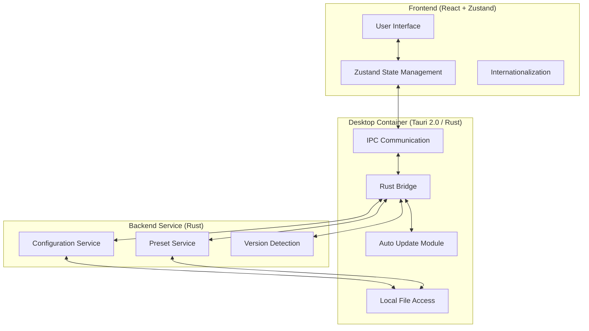

# 🔄 OMO Switch

[](https://github.com/ShellMonster/OMO-Switch/stargazers)
[](https://github.com/ShellMonster/OMO-Switch/blob/main/LICENSE)
[](https://github.com/ShellMonster/OMO-Switch/releases)


[English](README_EN.md) | [简体中文](README.md) | [繁體中文](README_TW.md) | [日本語](README_JP.md) | [한국어](README_KR.md)

**OMO Switch** is a desktop model configuration management tool designed for [oh-my-opencode](https://github.com/oh-my-opencode/oh-my-opencode). Built with **Tauri 2.0**, it provides visual AI model switching, preset management, model library browsing, and automatic updates.

<p align="center">
  
</p>

> 💡 **Core Features**:
> - **🤖 Agent Model Switching**: Visual management of all Agent model configurations
> - **📊 Config Overview**: Real-time view of config status, connected providers, model assignments
> - **🔑 Provider Management**: Configure and manage API Keys and model providers
> - **💾 Preset Management**: Save and load different model configuration presets
> - **🌐 Model Library**: Browse available models, pricing, and capabilities
> - **📥 Import/Export**: Backup and restore configuration files
> - **🔄 Auto Updates**: One-click update checking with automatic download and installation
> - **🌍 Multi-language**: Support for 5 languages including Chinese, English, Japanese, Korean

---

## 🌟 Key Features

- **🚀 High Performance**: Built on **Tauri 2.0** + **React 18**, lightweight and fast with minimal resource usage
- **🎨 Modern UI**: Designed with Tailwind CSS, clean and beautiful interface
- **🔄 Real-time Sync**: Configuration changes take effect immediately with automatic backup
- **💾 Smart Presets**: Save multiple configuration profiles for different scenarios
- **📦 Auto Updates**: Integrated Tauri Updater with automatic notifications and one-click installation
- **🌍 Multi-language**: Full support for Simplified Chinese, Traditional Chinese, English, Japanese, Korean
- **🛡️ Safe & Reliable**: Automatic backup before all configuration operations with validation support

---

## 🚀 Detailed Features

### 1. Agent Model Switching
- **Visual Configuration**: Graphical interface for managing all Agent models and intensity levels
- **Batch Operations**: Support batch modification of Agent configurations
- **Category Management**: Organize Agents by Category for batch settings
- **Real-time Preview**: Configuration changes displayed in real-time

### 2. Configuration Overview
- **Status Monitoring**: Real-time display of config file path, size, modification time
- **Provider List**: View connected model providers
- **Model Assignment Table**: Overview of all Agent model assignments
- **Config Validation**: Automatic validation of configuration format

### 3. Provider Management
- **API Key Configuration**: Visual management of API Keys for each provider
- **Custom Providers**: Add and configure custom model providers
- **Connection Status**: Real-time detection of provider connection status

### 4. Preset Management
- **Quick Save**: One-click save current configuration as preset
- **Multiple Presets**: Support creating multiple presets for different work scenarios
- **Preset Statistics**: Display Agent and Category counts in presets
- **Import/Export**: Support import and export of preset configurations

### 4. Model Library
- **Model List**: View all available models and their providers
- **Pricing Info**: Display input/output pricing for models
- **Capability Description**: View model capabilities and use cases
- **Quick Apply**: One-click apply model to specified Agent

### 5. Import/Export
- **Complete Backup**: Export all configurations to JSON file
- **Safe Import**: Automatic backup of current config before importing
- **History**: View import/export operation history
- **Cross-device Sync**: Sync between devices via configuration files

### 6. Settings
- **Language Switching**: 5 languages with real-time switching
- **Version Detection**: Detect OpenCode and oh-my-opencode versions
- **Auto Updates**: Check for app updates with one-click installation
- **GitHub Link**: Quick access to project repository

---

## 🏗️ Technical Architecture

### System Architecture


### Core Technology Stack
- **Frontend**: React 18 + TypeScript + Tailwind CSS + Zustand
- **Desktop Framework**: Tauri 2.0 (Rust)
- **State Management**: Zustand + persist middleware
- **Internationalization**: react-i18next
- **Icons**: Lucide React
- **Build Tool**: Vite

---

## 📂 Project Structure

```bash
├── src/                      # Frontend source code
│   ├── components/           # Components directory
│   ├── pages/                # Page components
│   ├── store/                # Zustand state management
│   ├── services/             # Service layer
│   └── i18n/                 # Internationalization
├── src-tauri/                # Tauri (Rust) source code
│   ├── src/
│   │   ├── commands/         # Tauri commands
│   │   └── services/         # Backend services
│   └── Cargo.toml            # Rust dependencies
└── README.md                 # Project documentation
```

---

## 💻 Developer Guide

### 1. Environment Setup
- **Node.js**: 18+ (recommended 20)
- **Rust**: 1.75+ (required for Tauri)
- **Bun** or **npm**: Package manager

### 2. Install Dependencies
```bash
# Using bun (recommended)
bun install

# Or using npm
npm install
```

### 3. Development Mode
```bash
# Start development server
bun run tauri:dev

# Or using npm
npm run tauri:dev
```

### 4. Build Application
```bash
# Build production version
bun run tauri:build

# Or using npm
npm run tauri:build
```

---

## 🔄 Auto Update Configuration

The project integrates Tauri official Updater plugin for automatic update checking and one-click installation.

### Setup Steps

1. **Generate Signing Key** (once, keep private key safe)
```bash
cd src-tauri
bun run tauri signer generate -- -w ~/.tauri/omo-switch.key
```

2. **Configure Public Key**: Add public key to `src-tauri/tauri.conf.json`
```json
{
  "plugins": {
    "updater": {
      "pubkey": "YOUR_PUBLIC_KEY_HERE"
    }
  }
}
```

3. **Configure GitHub Secrets**:
   - `TAURI_SIGNING_PRIVATE_KEY`: Private key content
   - `TAURI_SIGNING_PRIVATE_KEY_PASSWORD`: Private key password (if set)

4. **Release Updates**: Push new version tag to trigger automatic release

---

## 📄 License

This project is open source under the [MIT License](LICENSE).

---

## 🙏 Acknowledgments

- Built with [Tauri](https://tauri.app/), thanks to the Tauri team
- Thanks to [oh-my-opencode](https://github.com/oh-my-opencode/oh-my-opencode) for the powerful Agent framework
- Thanks to all contributors and users for their support

---

## 📞 Contact

- **GitHub**: [https://github.com/ShellMonster/OMO-Switch](https://github.com/ShellMonster/OMO-Switch)
- **Issues**: [https://github.com/ShellMonster/OMO-Switch/issues](https://github.com/ShellMonster/OMO-Switch/issues)

---

<p align="center">
  Made with ❤️ by OMO Team
</p>
